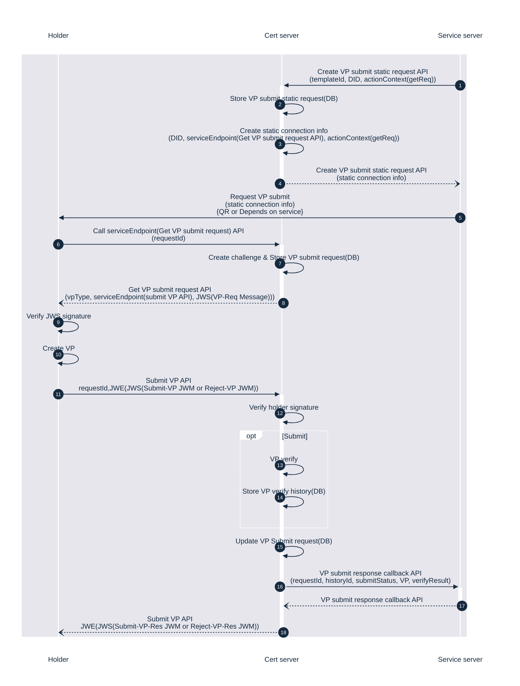

# 사용자 시나리오 & 시퀀스 다이어그램

좀 더 일반적인 유저 시나리오 입니다.

이하 시나리오에서 아래를 전제합니다.

- 서비스 제공자는 펫 관련 통합 서비스를 제공하는 Pet-i 입니다.

- Pet-i 서비스는 펫 카페, 병원, 은행등과 연계되어 Pet-i앱에 주인의 신원증명, 펫의 의료 기록등을 보관, 제출 할 수 있습니다.

## 시나리오 1

연계 펫 카페에 방문한 사용자가 직원앱과 연결하여 펫 예방접종 증명VP 제출, 직원앱은 Cert 서버로 전달하여 서버와 사용자가 통신하는 경우

- 사용자가 Dynamic QR을 생성(웹소켓 채널 생성)하고 직원 앱에서 이를 스캔합니다.
- 직원 앱에서 Cert 서버에게 Dynamic DID Verify API를 호출해서 서버에서 사용자와 웹소켓을 연결합니다.
  - 사용자와 서버가 DID-Auth protocol, VP protocol을 실시합니다.
- 서버는 검증결과를 저장한 후 CallbackURL로 서비스 서버에 결과를 전달한 후 직원 앱에 API응답을 보냅니다.

```mermaid
sequenceDiagram
%%{init:{'theme':'base','themeVariables':{'fontSize':'20px','primaryColor':'#fff','primaryBorderColor':'#fff','primaryTextColor':'#152A3F','noteBkgColor':'#F5E080','noteTextColor':'#152D3F'}}}%%
%%{init:{'themeCSS':'text{fill:#fff;};'}}%%
rect RGB(231,230,237)
autonumber

participant h as Holder
participant ws as WebSocket
participant cs as Cert server
participant v as Verifier app
participant ss as Service server

title (Holder가 채널 시작)Holder의 dynamic QR - Verifier 스캔 → Cert server 연결

h->>ws: Create WS connection & Create channel
activate ws
ws--)h: Connected
h->>h: Create dynamic QR(base64URL encoded DID-Connect-Request Message)<br>(actionContext, serviceEndpoint, socketId, initiatorType)
v-)v: Camera on
v-->>h: Tag QR
v->>+cs: Dynamic VP Verify API<br>(DID, templateId, DID-Connect-Request Message, noCallbackRequired)
cs->>ws: Create WS connection & Join channel
ws--)cs: Connected

%%  DID Auth DID Connection Protocol start
note over h,cs:  DID Auth DID Connection Protocol - initiated by Holder start
note over cs: Derive DID-Shared-Secret-Key by ECDH(verifier private key & holder public key)
note over cs: Create ephemeral public key(epk)
note over cs: Derive one-time shared secret key by ECDH(epk private key & holder public key)
note over cs: Sign & Encrypt {DID-Auth-Init} message (encrypted using one-time shared secret key)
 cs->>ws: JWE(JWS(DID-Auth-Init JWM))<br>(actionContext, socketId, peerSocketId)
 ws->>h: Relay message
note over h: Derive one-time shared secret key<br>(using epk and holder DID's private key)<br>and decrypt {DID-Auth-Init}
note over h: Verify verifier DID
break Auth failed
	h->>ws: JWE(DID-Auth-Failed JWM)<br>(actionContext, reason)
	ws->>cs: Relay message
	note over h: WS disconnect
	note over cs: WS disconnect
end

note over h: Derive DID-Shared-Secret-Key by ECDH(verifier public key & holder private key)
note over h: Sign & Encrypt {DID-Auth} message by DID-Shared-Secret-Key
h->>ws: JWE(JWS(DID-Auth JWM))<br>(actionContext, socketId, peerSocketId)
ws->>cs: Relay message
note over cs: Decrypt {DID-Auth}<br>using DID-Shared-Secret-Key
note over cs: Verify holder DID
break Auth failed
	cs->>ws: JWE(DID-Auth-Failed JWM)<br>(actionContext, reason)
	ws->>h: Relay message
	note over h: WS disconnect
	note over cs: WS disconnect
end

cs->>ws: JWE(DID-Connected JWM)<br>(actionContext, status)
ws->>h: Relay message
note over h,cs:  DID Auth DID Connection Protocol done
%%  DID Auth DID Connection Protocolend
cs->>cs: Get requestVCs from template
cs->>cs: Create challenge
%% VP Protocol start
note over h,cs: VP Protocol start

cs->>ws: JWE(VP-Req JWM)<br>(requestVCs, challenge)
ws->>h: Relay message
alt Response: Submit
	h->>h: Create VP
	h->>ws: JWE(Submit-VP JWM)<br>( VP(jwt encoded?))
  ws->>cs: Relay message
	cs->>cs: Verify VP
	cs->>cs: Store VP verify history(API or DB)
	cs->>ws: JWE(Submit-VP-Res JWM)<br>(status)
	ws->>h: Relay message
else Response: Reject
	h->>ws: JWE(Reject-ReqVP JWM)
  ws->>cs: Relay message
	cs->>ws: JWE(Reject-ReqVP-Res JWM)<br>(status)
	ws->>h: Relay message
else Response: Submit Later
	h->>ws: JWE(Submit-VP-Later JWM)
	ws->>cs: Relay message
	cs->>cs: Store VP submit request(API or DB)<br>(requestId)
  cs->>ws: JWE(Submit-VP-Later-Res JWM)<br>(callbackUrl(requestId))
	ws->>h: Relay message
end

note over h,cs: VP Protocol Done
%% VP Protocol end
note over h: WS disconnect
note over cs: WS disconnect
deactivate ws

opt if(!req.body.noCallbackRequired)
	cs->>+ss: VP submit response callback API<br>(submitStatus, historyId, VP, verifyResult)
	ss--)-cs: VP submit response callback API
end
cs--)-v: Dynamic VP Verify API<br>(status, VP, verifyResult, historyId)

opt Holder submit VP later
	h->>+cs: Submit VP API<br>requestId, JWE(JWS(Submit-VP JWM or Reject-VP JWM))
	cs->>cs: Verify holder signature
	opt submit
		cs->>cs: Verify VP
		cs->>cs: Store VP verify history(DB)
	end
	cs->>cs: Update VP submit request(DB)
	cs->>+ss: VP submit response callback API<br>(requestId, submitStatus, historyId, VP, verifyResult)
	ss--)-cs: VP submit response callback API
	cs--)-h: Submit VP API<br>JWE(JWS(Submit-VP-Res JWM or Reject-VP-Res JWM))
end

end
```

## 시나리오 2

연계 펫 카페에 방문한 사용자가 테이블의 (static) QR을 촬영하여 WebSocket으로 펫 신분증명VP 제출하는 경우

- 사전에 매장에서 Cert 서버에 Create Static Request API 호출하여 staic 요청을 생성하고 QR을 출력하여 가게 내부에 게시합니다.
- 사용자는 매장에 방문하여 게시된 QR을 Pet-i으로 스캔합니다.(웹소켓 채널 생성) - QR 내 service endpoint(Static VP verify API)를 호출하여 서버와 웹소켓을 연결합니다.
  - 사용자와 서버가 DID-Auth protocol, VP protocol을 실시합니다.
- 서버는 검증결과를 저장한 후 CallbackURL로 서비스 서버에 결과를 전달한 후 사용자 앱에 API응답을 보냅니다.

```mermaid
sequenceDiagram
autonumber
%%{init:{'theme':'base','themeVariables':{'fontSize':'20px','primaryColor':'#fff','primaryBorderColor':'#fff','primaryTextColor':'#152A3F','noteBkgColor':'#F5E080','noteTextColor':'#152D3F'}}}%%
%%{init:{'themeCSS':'text{fill:#fff;};'}}%%
rect RGB(231,230,237)
participant h as Holder
participant ws as WebSocket
participant cs as Cert server
participant ss as Service server

title (Holder가 채널 시작)static QR - Holder 스캔 → Cert server 연결

ss->>+cs: Create VP submit static request API<br>(template id, DID, actionContext(connect))
cs->>cs: Store VP submit static request(DB)
cs->>cs: Create static connection info<br>(DID, serviceEndpoint(Static VP Verify API), actionContext(connect))
cs--)-ss: Create VP Submit static request API<br>(static connection info)
ss->>ss: Create static QR<br>(static connection info)
h-)h: Camera on

ss-->>h: Tag QR

h->>ws: Create WS connection & Create channel
activate ws
ws--)h: Connected
h->>h: Create DID-Connect-Request JWM<br>(actionContext, serviceEndpoint, socketId, initiatorType)
h->>+cs: Call serviceEndpoint(static VP verify API)<br>(DID-Connect-Request Message)
cs->>cs: Store VP submit request(DB)
cs--)-h: Static VP Verify API
cs->>ws: Create WS connection & Join channel
ws--)cs: Connected

%% DID Connection Protocol start
note over h,cs: DID Connection Protocol - initiated by Holder start
note over cs: Derive DID-Shared-Secret-Key by ECDH(verifier private key & holdder public key)
note over cs: Create ephemeral public key(epk)
note over cs: Derive one-time shared secret key by ECDH(epk private key & holder public key)
note over cs: Sign & Encrypt {DID-Auth-Init} message (encrypted using one-time shared secret key)
 cs->>ws: JWE(JWS(DID-Auth-Init JWM))<br>(actionContext, socketId, peerSocketId)
 ws->>h: Relay message
note over h: Derive one-time shared secret key<br>(using epk and holder DID's private key)<br>and decrypt {DID-Auth-Init}
note over h: Verify verifier DID
break Auth failed
	h->>ws: JWE(DID-Auth-Failed JWM)<br>(actionContext, reason)
	ws->>cs: Relay message
note over h: WS disconnect
note over cs: WS disconnect
end

note over h: Derive DID-Shared-Secret-Key by ECDH(verifier public key & holder private key)
note over h: Sign & Encrypt {DID-Auth} message by DID-Shared-Secret-Key
h->>ws: JWE(JWS(DID-Auth JWM))<br>(actionContext, socketId, peerSocketId)
ws->>cs: Relay message
note over cs: Decrypt {DID-Auth}<br>using DID-Shared-Secret-Key
note over cs: Verify holder DID
break Auth failed
	cs->>ws: JWE(DID-Auth-Failed JWM)<br>(actionContext, reason)
	ws->>h: Relay message
note over h: WS disconnect
note over cs: WS disconnect
end

cs->>ws: JWE(DID-Connected JWM)<br>(actionContext, status)
ws->>h: Relay message
note over h,cs: DID Connection Protocol done
%% DID Connection Protocol end

cs->>cs: Get requestVCs from template
cs->>cs: Create challenge

%% VP Protocol start
note over h,cs: VP Protocol start

cs->>ws: JWE(VP-Req JWM)<br>(requestVCs, challenge)
ws->>h: Relay message
alt Response: Submit
	h->>h: Create VP
	h->>ws: JWE(Submit-VP JWM)<br>( VP(jwt encoded?))
  ws->>cs: Relay message
	cs->>cs: Verify VP
	cs->>cs: Store VP verify history(API or DB)
	cs->>ws: JWE(Submit-VP-Res JWM)<br>(status)
	ws->>h: Relay message
else Response: Reject
	h->>ws: JWE(Reject-ReqVP JWM)
  ws->>cs: Relay message
	cs->>ws: JWE(Reject-ReqVP-Res JWM)<br>(status)
	ws->>h: Relay message
else Response: Submit Later
	h->>ws: JWE(Submit-VP-Later JWM)
	ws->>cs: Relay message
	cs->>cs: Store VP submit request(API or DB)<br>(requestId)
  cs->>ws: JWE(Submit-VP-Later-Res JWM)<br>(callbackUrl(requestId))
	ws->>h: Relay message
end

note over h,cs: VP Protocol Done
%% VP Protocol end
note over h: WS disconnect
note over cs: WS disconnect
deactivate ws

cs->>+ss: VP submit response callback API<br>(requestId, submitStatus, historyId, VP, verifyResult)
ss--)-cs: VP submit response callback API

opt Holder submit VP later
	h->>+cs: Submit VP API<br>JWE(requestId, JWS(Submit-VP JWM or Reject-VP JWM))
	cs->>cs: Verify holder signature
	opt submit
		cs->>cs: Verify VP
		cs->>cs: Store VP verify history(DB)
	end
	cs->>cs: Update VP submit request(DB)
	cs->>+ss: VP submit response callback API<br>(requestId, submitStatus, historyId, VP, verifyResult)
	ss--)-cs: VP submit response callback API
	cs--)-h: Submit VP API<br>JWE(JWS(Submit-VP-Res JWM or Reject-VP-Res JWM))
end

end
```

## 시나리오 3

펫 카페에서 직원의 Dynamic QR을 사용자가 스캔하여 펫 신분증명VP 제출하는 경우

- 직원 앱이 Cert 서버에 Create Dynamic VP Submit Request API을 호출하여 Dynamic QR정보 수신 및 생성합니다.(웹소켓 채널 생성)
- 사용자는 Pet-i 앱으로 QR을 스캔하여 서버와 웹소켓을 연결합니다.
  - 사용자와 서버가 DID-Auth protocol, VP protocol을 실시합니다.
- 서버는 검증결과를 저장한 후 CallbackURL로 서비스 서버에 결과를 전달한 후 사용자 앱에 API응답을 보냅니다.

```mermaid
sequenceDiagram
autonumber
%%{init:{'theme':'base','themeVariables':{'fontSize':'20px','primaryColor':'#fff','primaryBorderColor':'#fff','primaryTextColor':'#152A3F','noteBkgColor':'#F5E080','noteTextColor':'#152D3F'}}}%%
%%{init:{'themeCSS':'text{fill:#fff;};.messageText:nth-of-type(43),.messageText:nth-of-type(44),.messageText:nth-of-type(46){fill:blue;};'}}%%
rect RGB(231,230,237)
participant h as Holder
participant ws as WebSocket
participant cs as Cert server
participant v as Verifier app
participant ss as Service server

title (Verifier가 채널 시작)Verifier의 dynamic QR - Holder 스캔 → Cert server 연결

v->>+cs: Create dynamic request API<br>(did, actionContext, template id)
cs->>ws: Create WS connection & Create channel
activate ws
ws--)cs: Connected
cs--)-v: Create dynamic request API<br>(DID-Connect-Request Message)<br>(actionContext, serviceEndpoint, socketId, initiatorType)
v->>v: Create dynamic QR(base64URL encoded DID-Connect-Request Message)<br>(actionContext, serviceEndpoint, socketId, initiatorType)
h-)h: Camera on
h-->>v: Tag QR
h->>ws: Create WS connection & Join channel
ws--)h: Connected

%% DID Connection Protocol start
note over h,cs: DID Connection Protocol - initiated by Verifier start
note over h: Derive DID-Shared-Secret-Key by ECDH(holder private key & verifier public key)
note over h: Create ephemeral public key(epk)
note over h: Derive one-time shared secret key by ECDH(epk private key & verifier public key)
note over h: Sign & Encrypt {DID-Auth-Init} message (encrypted using one-time shared secret key)
 h->>ws: JWE(JWS(DID-Auth-Init JWM))<br>(actionContext, socketId, peerSocketId)
 ws->>cs: Relay message
note over cs: Derive one-time shared secret key<br>(using epk and verifier DID's private key)<br>and decrypt {DID-Auth-Init}
note over cs: Verify Holder DID
break Auth failed
	cs->>ws: JWE(DID-Auth-Failed JWM)<br>(actionContext, reason)
	ws->>h: Relay message
	note over cs: WS Disconnect
	note over h: WS Disconnect
end

note over cs: Derive DID-Shared-Secret-Key by ECDH(holder public key & verifier private key)
note over cs: Sign & Encrypt {DID-Auth} message by DID-Shared-Secret-Key
cs->>ws: JWE(JWS(DID-Auth JWM))<br>(actionContext, socketId, peerSocketId)
ws->>h: Relay message
note over h: Decrypt {DID-Auth}<br>using DID-Shared-Secret-Key
note over h: Verify verifier DID

break Auth failed
	h->>ws: JWE(DID-Auth-Failed JWM)<br>(actionContext, reason)
	ws->>cs: Relay message
	note over h: WS Disconnect
	note over cs: WS Disconnect
end
h->>ws: JWE(DID-Connected JWM)<br>(actionContext, status)
ws->>cs: Relay message
cs->>ws: JWE(DID-Connected JWM)<br>(actionContext, status)
ws->>h: Relay message
note over h,cs: DID Connection Protocol done
%% DID Connection Protocol done
cs->>cs: Get requestVCs from template
cs->>cs: Create challenge

%% VP Protocol start
note over h,cs: VP Protocol start

cs->>ws: JWE(VP-Req JWM)<br>(requestVCs, challenge)
ws->>h: Relay message
alt Response: Submit
	h->>h: Create VP
	h->>ws: JWE(Submit-VP JWM)<br>( VP(jwt encoded?))
  ws->>cs: Relay message
	cs->>cs: Verify VP
	cs->>cs: Store VP verify history(API or DB)
	cs->>ws: JWE(Submit-VP-Res JWM)<br>(status)
	ws->>h: Relay message
else Response: Reject
	h->>ws: JWE(Reject-ReqVP JWM)
  ws->>cs: Relay message
	cs->>ws: JWE(Reject-ReqVP-Res JWM)<br>(status)
	ws->>h: Relay message
else Response: Submit Later
	h->>ws: JWE(Submit-VP-Later JWM)
	ws->>cs: Relay message
	cs->>cs: Store VP submit request(API or DB)<br>(requestId)
  cs->>ws: JWE(Submit-VP-Later-Res JWM)<br>(callbackUrl(requestId))
	ws->>h: Relay message
end

note over h,cs: VP Protocol done
%% VP Protocol done

note over cs: WS disconnect
note over h: WS disconnect
deactivate ws

cs->>+ss: VP submit response callback API<br>(submitStatus, VP, verifyResult)
ss-)v: Relay VP sumit response
ss--)-cs: VP submit response callback API

opt Holder submit VP later
	h->>+cs: Submit VP API<br>JWE(requestId, JWS(Submit-VP JWM or Reject-VP JWM))
	cs->>cs: Verify holder signature
	opt submit
		cs->>cs: Verify VP
		cs->>cs: Store VP verify history(DB)
	end
	cs->>cs: Update VP submit request(DB)
	cs->>+ss: VP submit response callback API<br>(requestId, submitStatus, historyId, VP, verifyResult)
	ss--)-cs: VP submit response callback API
	cs--)-h: Submit VP API<br>JWE(JWS(Submit-VP-Res JWM or Reject-VP-Res JWM))
end

end

```

## 시나리오 4

Pet-i 연계 은행 사이트에 접속하여 대출 업무 진행. 대출 관련 서류(재직증명, 건보료 증명 등) VP를 비대면 온라인으로 제출하는 경우

- Pet-i에서 Cert 서버에 Create static Request API 호출하여 staic 요청을 생성하고 접속정보(QR)을 은행측에 전달합니다.
- 은행에서는 온라인 제출 메뉴에 해당 QR을 게시합니다.
- 사용자는 은행 사이트에서 관련 업무를 진행후 서류 제출 페이지에서 QR을 확인, 스캔합니다.
- 스캔된 QR의 Service Endpoint(Get VP Submit Request API)를 호출하여 VP요청정보 확인과 verifier에 대한 검증을 실시 합니다.
- 사용자는 VP를 생성하여 Get VP Submit Request API의 Submit endpoint(VP Submit API)를 호출하여 VP를 제출합니다.
- 서버는 검증결과를 저장한 후 CallbackURL로 서비스 서버에 결과를 전달한 후 사용자 앱에 API응답을 보냅니다.
- 서비스 서버는 이를 은행서버에 전달합니다.
- 은행은 전달받은 내용을 토대로 업무를 진행합니다.

