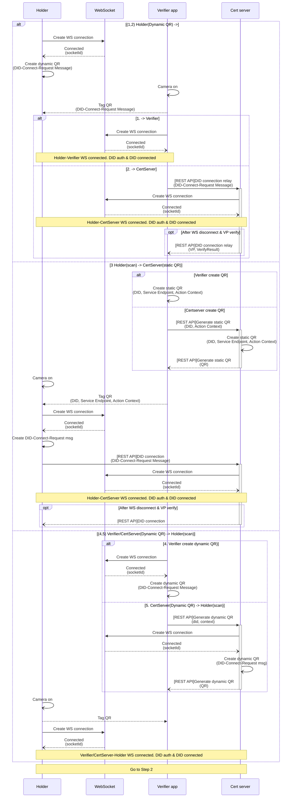
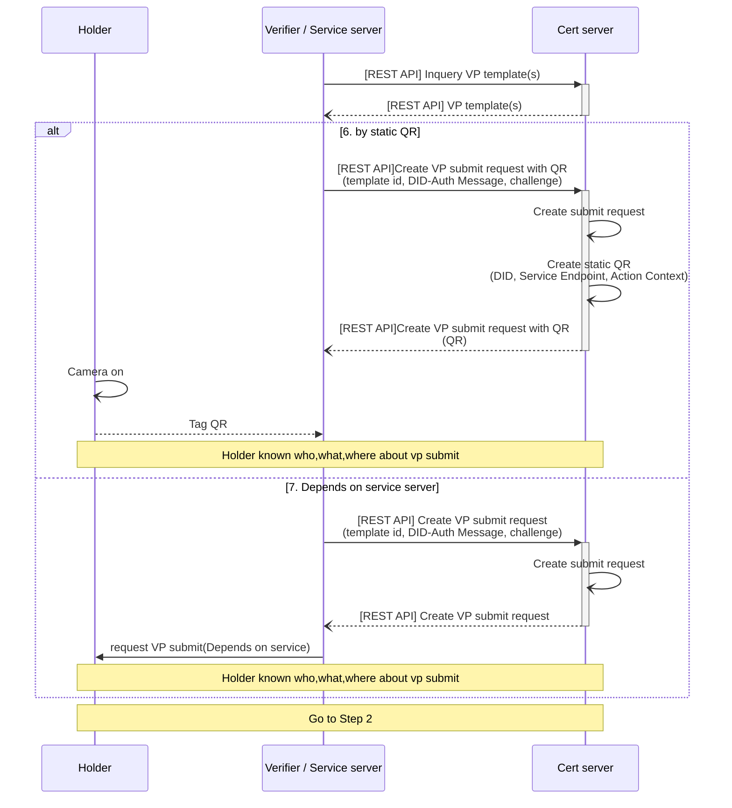

# Step 1. VP 제출 요청 단계(VP Submit Request Step)

- 사용자와 검증자(Verifier)가 서로 연결되는 단계입니다.
- 검증자가 암호화 채널 혹은 REST API를 통해 VP 제출을 요청하는 단계입니다.
- 가능한 연결 방법은 아래와 같습니다.
  1.  Holder Dynamic QR - Verifier connection(WebSocket)
  2.  Holder Dynamic QR - Cert server connection(WebSocket)
  3.  Holder - static QR(Cert Server)(WebSocket)
  4.  Verifier Dynamic QR - Holder connection(WebSocket)
  5.  Cert server Dynamic QR - Holder connection(WebSocket)
  6.  Holder - static QR(Cert Server)(REST API)
  7.  Depands on Server - Holder (REST API)

### WebSocket을 이용한 연결

### REST API를 이용한 연결

