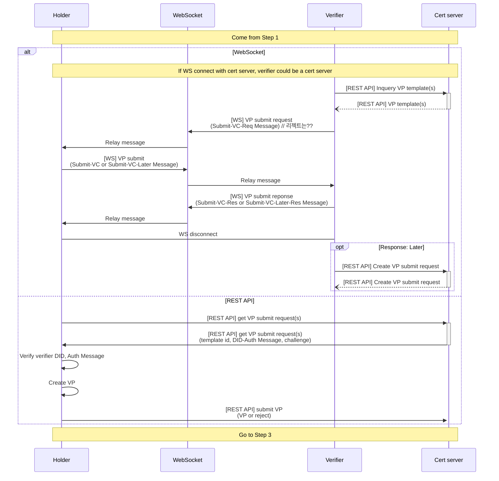

# Step 2. VP 제출 단계(VP Submit Step)

- 사용자가 VP 제출 요청에 따라 응답하는 단계입니다.
- 즉시 제출하거나 거절 혹은 추후 제출 하도록 응답할 수 있습니다.
- 연결방식에 따라 `WebSocket` 제출, `REST API` 제출 방식이 있습니다.

```mermaid
sequenceDiagram

participant h as Holder
participant ws as WebSocket
participant v as Verifier
participant cs as Cert server

note over h,cs: Come from Step 1
alt WebSocket
    note over h,cs: If WS connect with cert server, verifier could be a cert server
    v->>+cs: [REST API] Inquery VP template(s)
    cs--)-v: [REST API] VP template(s)

    v->>ws: [WS] VP submit request<br>(Submit-VC-Req Message) // 리젝트는??
    ws->>h: Relay message
    h->>ws: [WS] VP submit<br>(Submit-VC or Submit-VC-Later Message)
    ws->>v: Relay message
    v->>ws: [WS] VP submit reponse<br>(Submit-VC-Res or Submit-VC-Later-Res Message)
    ws->>h: Relay message
    h->v: WS disconnect
    opt Response: Later
        v->>+cs: [REST API] Create VP submit request
        cs--)-v: [REST API] Create VP submit request
    end
else REST API
    h->>+cs: [REST API] get VP submit request(s)
    cs->>-h: [REST API] get VP submit request(s)<br>(template id, DID-Auth Message, challenge)
    h->>h: Verify verifier DID, Auth Message
    h->>h: Create VP
    h->>+cs: [REST API] submit VP<br>(VP or reject)
end
note over h,cs: Go to Step 3
```
