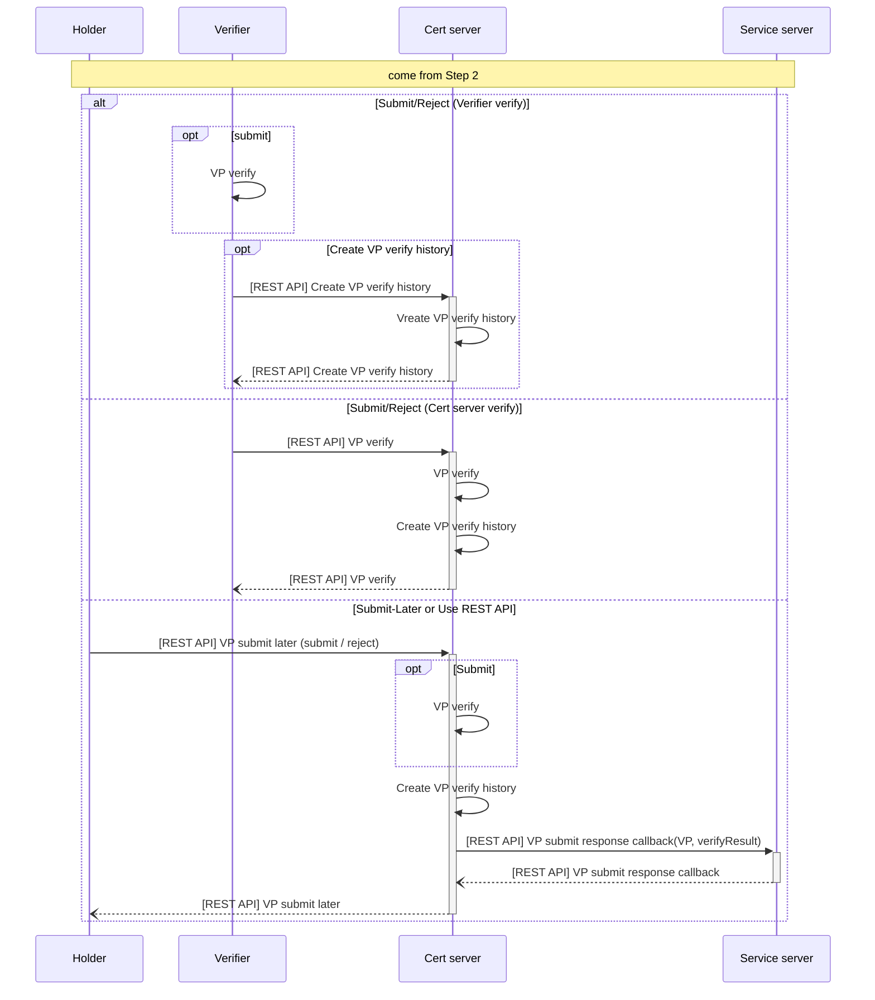

# Step 3. VP 검증 단계(After VP Submit Step)

- 제출된 VP를 검증자가 검증하거나 서버에 검증요청 하는 단계입니다.
- 추후 제출인 경우 사용자가 REST API를 통해 제출하는 단계입니다.
- 제출 되거나 거절된 검증 내역을 저장합니다.
- 제출된 내역에 대해 Cert 서비스 서버가 서비스 제공자의 서비스 서버에 웹훅(콜백)을 수행합니다.
- 설정에 따라 `Verifier Verify` 방식과 `Cert Server Verify` 방식이 있습니다.

