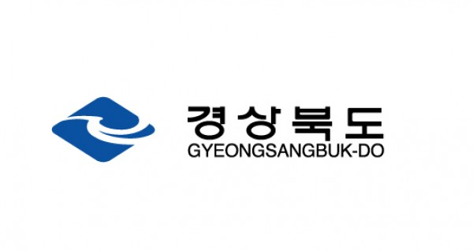

# Introduction

### Infra Tokenization이란? 

Infra Tokenization은 [Infrablockchain](https://infrablockchain.net)에서 제공하는 토큰 시스템입니다.&#x20;

NFT, 법정화폐 기반 스테이블 토큰, 증권형 토큰을 발행하고 운영할 수 있고 필요한 모든 과정은 콘솔 또는 SDK를 통해 간편하게 진행할 수 있습니다.

영지식증명(Zero-Knowledge Proof) 기술을 활용해서 프라이버시가 보호되는 토큰 전송이 가능하며, 중앙 서버 없이 블록체인 상에서 동작하는 토큰 거래 시스템 (DEX, Decentralized Exchange)을 구축할 수 있습니다.

### Features

#### 각종 토큰 발행

FT(Fungible Token), NFT(Non Fungible Token), STO(Security Token Offering) 등의 토큰을 원하는 형태로 발행 및 운영할 수 있습니다. 또한 블록체인 상의 데이터를 간편하게 볼 수 있는 익스플로러가 제공되어 필요한 지표를 확인하여 더욱 효율적으로 시스템을 운영할 수 있습니다.

#### NFT 마켓 플레이스 구축

NFT 마켓 플레이스는 발행된 NFT를 거래할 수 있는 시스템입니다. 자체 서비스에 연결할 NFT 시스템을 위해 InfraBlockchain에서는 NFT 발행에 이어서 NFT 마켓 플레이스까지 구축할 수 있는 기능을 제공합니다.&#x20;

#### 익명 토큰 전송

기본적으로 블록체인 상의 모든 트랜잭션은 공용 장부에 기록됩니다. 만약 공개하기 민감한 정보가 포함되어 있다면 영지식증명 기술을 이용한 익명 토큰 전송 기능을 고려해볼 수 있습니다. Infra Tokenization에서는 필요한 경우에 간단하게 설정할 수 있도록 지원하고 있습니다.

#### 탈중앙화 거래소 구축

DEX는 중앙 서버가 필요하지 않은, 완전하게 블록체인 위에서 동작하는 토큰 거래 시스템입니다. 토큰 거래에 필요한 모든 기능은 블록체인의 스마트 컨트랙트로 구현 되어 있으며 필요한 경우 손쉽게 거래 시스템을 구축할 수 있도록 지원하고 있습니다.

### Support us 

